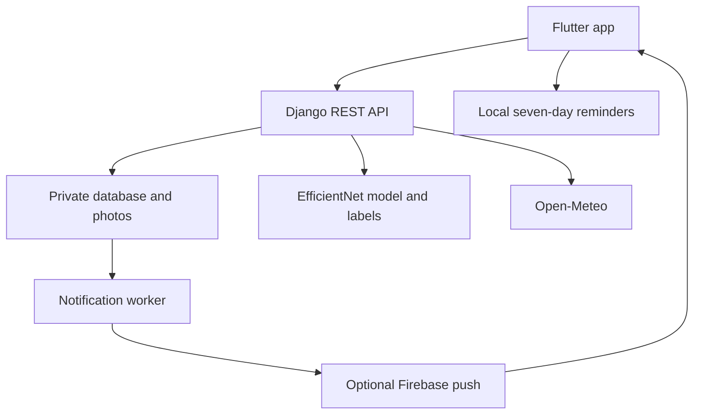

# Architecture and decisions

## Data model

| Model | Responsibility |
| --- | --- |
| Farmer | Authenticated account, saved farm coordinates, sharing choices and alert radius |
| ApiSession | SHA-256 token digest, user and expiry; no raw session token in database |
| Scan | Private photo, prediction, care suggestions, farmer notes, approximate scan location, outcome and optional parent scan |
| Notification | Persistent account inbox; unique event key prevents duplicate database notices |
| Device | Optional Firebase token linked to the signed-in farmer |

The Django admin uses normal Django session authentication and CSRF protection. The mobile API uses bearer authentication. The local database is created with migrations; no user data or account passwords are included in the archive.

## Model integration

The supplied `.keras` file reports Keras 3.15.0 metadata. It accepts `(None,224,224,3)` float input and produces 33 softmax scores. The supplied `labels.txt` is the authoritative class order. The model is lazy-loaded once per Python process with `compile=False` and `safe_mode=True`; prediction execution is serialized within a process.

The preprocessing matches the supplied predictor: RGB, 224×224 nearest-neighbour resize, raw pixel values 0–255. The model contains EfficientNet rescaling. Before inference, the API also normalizes image orientation and strips metadata when creating its stored JPEG.

The original training file is preserved as a reference and is never run by setup. Its training augmentation settings are not used to alter the supplied trained weights. Original treatment strings are retained inside the reference script; runtime advice uses conservative category-based care steps rather than unverified pesticide prescriptions.

## Follow-up state

A detected issue schedules a seven-day check. A follow-up must belong to the same account and use the same selected crop. Creating it marks the parent's follow-up complete and creates a new scan with a one-to-one parent link. If the new scan still suggests an issue it receives its own seven-day due date. A healthy or uncertain scan does not schedule a new issue reminder. Farmers can start a fresh scan at any time.

Marking a scan resolved completes its reminder. Reopening an outcome does not automatically create another reminder; start a new scan for a new check. A confidence difference is never presented as measured recovery.

## Weather and geography

Open-Meteo requests are cached for 15 minutes using rounded farm coordinates. General advice responds to humidity, temperature, precipitation and wind. The thresholds are simple application rules; they are not a validated crop-specific disease forecasting model.

Nearby matching uses approximate scan coordinates, a 14-day reporting window and Haversine distances. This SQLite implementation iterates eligible reports/recipients and is suitable for a local project or small pilot. A large deployment should use PostgreSQL/PostGIS indexes and a task queue. Push dispatch should be run by one worker or protected by a distributed lease when scaled.

## Explicit limitations

This implementation cannot establish a plant disease from a model score alone. No held-out dataset was supplied, so model sensitivity, specificity, field accuracy and calibration are unknown. The model may confidently misclassify unsupported images. Low-confidence handling and crop matching reduce some mistakes but do not solve out-of-distribution detection. Treatment guidance must be validated for local crops and conditions before public use.

Device permissions, camera/GPS hardware, real push delivery and store signing require testing on the intended Android/iOS devices. Hosting, Firebase project creation and app-store publication are separate deployment tasks.
